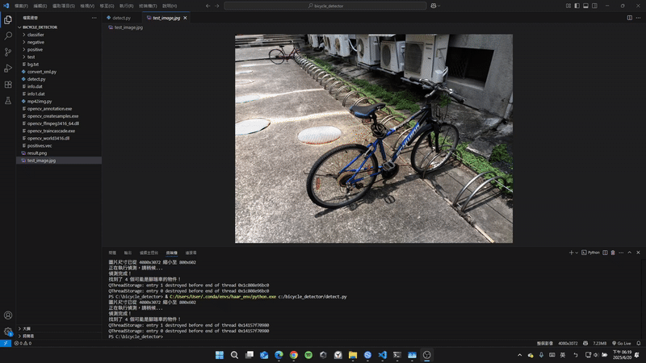

# 腳踏車影像辨識

元智大學 113-2 學期 EEB215「電腦視覺與影像處理概論」期末專題

姓名: 李俊樨

學號: 1120418

## 專案摘要

隨著AI的發展，文字已經不是與AI互動的唯一選擇。大多數時候，已經可以直接上傳圖片，讓AI對其內容進行分析並回答問題，這就凸顯了電腦視覺的重要性。所以我想要藉由這次的實作，親手訓練一個物件偵測模型，從中學習電腦視覺的關鍵技術與完整流程。

程式語言: Python

核心函式庫: OpenCV

演算法: Haar 特徵 & 級聯分類器

## 如何執行

本專案的模型可用於偵測靜態圖片中的腳踏車。

### 執行環境

請確保您的電腦已安裝 Python 與 OpenCV 函式庫。

### 執行步驟

檔案結構：請將 detect.py 腳本、存放模型的 classifier 資料夾，以及您想測試的圖片，全部放在同一個目錄下。

修改腳本：打開 detect.py 檔案，找到 image_path 變數，並將其值修改為您要測試的圖片檔名。

```python
image_path = 'your_test_image.jpg'
```

或將圖片命名為 `test_image.jpg`

執行指令：打開終端機，cd 到您的專案目錄，然後執行以下指令：

```cmd
python detect.py
```

程式會彈出一個視窗，顯示偵測結果。

## 專案成果展示

### 原始圖片:


### 偵測結果:


以下是經過我們訓練的 cascade.xml 模型實際運行的偵測結果。由於訓練樣本數有限，模型會出現將物體局部辨識為目標，或是產生部分誤判的情況。透過調整 detectMultiScale 中的 minNeighbors 參數，可以過濾掉大部分零碎偵測框。

## Demo 影片


