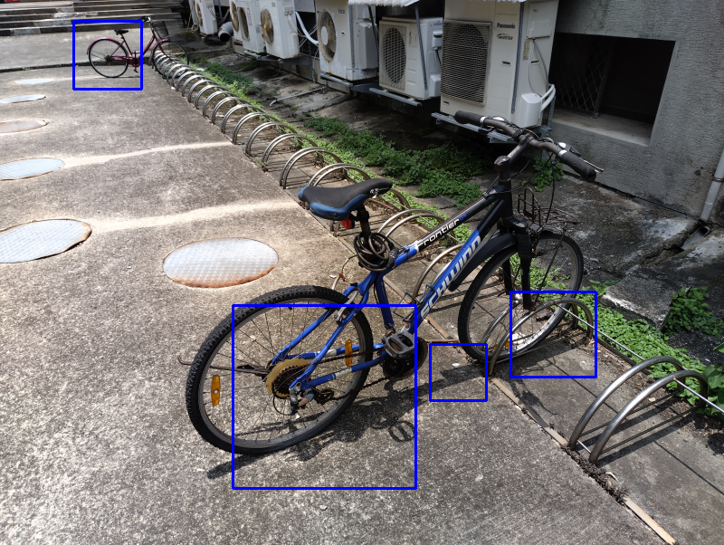

##腳踏車影像辨識 (Bicycle Image Recognition)

元智大學 113-2 學期 EEB215A「電腦視覺與影像處理概論」課程期末專題

姓名: 李俊樨

學號: 1120418

#專案摘要

本專案旨在實作一個基於傳統電腦視覺技術的物件偵測系統，其目標為訓練並驗證一個能夠在靜態影像中辨識腳踏車的 Haar 級聯分類器 (Haar Cascade Classifier)。專案全程使用 Python 語言及 OpenCV 函式庫作為主要開發工具，涵蓋了從資料集收集、樣本標註、模型訓練、參數調整到最終成果驗證的完整流程。

隨著 AI 技術的發展，視覺已成為人機互動的關鍵一環。本專案透過親手打造一個物件偵測模型，深入學習了機器學習專案的開發管線，並對傳統電腦視覺演算法的優勢與其先天限制有了更深刻的理解。

程式語言: Python

核心函式庫: OpenCV

演算法: Haar-like 特徵 & 級聯分類器 (Cascade Classifier)

#如何執行

本專案的模型可用於偵測靜態圖片中的腳踏車。

執行環境

請確保您的電腦已安裝 Python 與 OpenCV 函式庫。

執行步驟

檔案結構：請將 detect.py 腳本、存放模型的 classifier 資料夾，以及您想測試的圖片，全部放在同一個目錄下。

修改腳本：打開 detect.py 檔案，找到 image_path 變數，並將其值修改為您要測試的圖片檔名。

image_path = 'your_test_image.jpg'

執行指令：打開終端機，cd 到您的專案目錄，然後執行以下指令：

'''
python detect.py
'''

程式會彈出一個視窗，顯示偵測結果。

專案成果展示 (Demonstration)

這是一張用來驗證模型效果的原始圖片。

偵測結果

以下是經過我們訓練的 cascade.xml 模型實際運行的偵測結果。由於訓練樣本數有限，模型會出現將物體局部辨識為目標，或是產生部分誤判的情況。透過調整 detectMultiScale 中的 minNeighbors 參數，可以過濾掉大部分信心度較低的零碎偵測框。

Demo 影片

我們也錄製了一段實際操作 detect.py 的過程影片。

心得與結論

本專案完整地走過了從資料收集到模型應用的每一個環節。過程中最大的挑戰在於資料集的準備與標註，以及理解 Haar 分類器對於樣本多樣性與一致性的高度要求。雖然最終因為樣本數的限制，模型的準確率與泛化能力有限，但這次的實作經驗對於理解電腦視覺中物件偵測的核心概念有著巨大的幫助。未來的方向將是擴充更高品質、更多樣化的資料集，並嘗試更進階的演算法。
